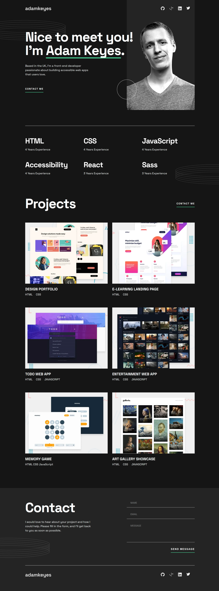

# Jeff Guleserian - personal portfolio website

This is an adaptation to a challenge I took on from Frontend Mentor: [Single-page developer portfolio challenge on Frontend Mentor](https://www.frontendmentor.io/challenges/singlepage-developer-portfolio-bBVj2ZPi-x). I have made many adaptations to make the page my own, so to speak, including adding animation, aesthetic changes, adding a database, and of course, updating the information so that it reflects my own experience and work. 

## Table of contents

- [Overview](#overview)
  - [The challenge](#the-challenge)
  - [Screenshot](#screenshot)
  - [Links](#links)
- [My process](#my-process)
  - [Built with](#built-with)
  - [What I learned](#what-i-learned)
  - [Continued development](#continued-development)
- [Author](#author)
- [Acknowledgments](#acknowledgments)

## Overview

The website began as a single page portfolio website created for the purpose of transitioning out of one career to another, i.e., from education to web development. In its one-page form, the site includes a navbar for brand identity and social media navigation, a header to establish theme, an experience section, a section for displaying some of my work, and a contact section for potential clients or employers.

Eventually this site will be joined to the @media site. @media is a freelance business company I have formed with two of my children, Emily and Trevor. Together we cover the gambit graphic arts, web development, and data analysis.

### The challenge

The challenges of Frontend Mentor aside, the challenge to myself is to convert this site into more than just a presentation of myself. Additional challenges include creating a contact database that includes more form entries and validation, self-generating email to confirm that their message was received.

Fron an aesthetics standpoint, I would like to create some animations for some of the graphics pieces, add a bit more interest to the interface, and modernize it just a little. I have also created a favicon with my initials and in line with the color scheme of the site itself.

Additionally, I would like the site itself to act as an exemplar on its own.

### Screenshot

The following is the full-sized screenshot (width: 1140px). Other size screenshots, for tablet and mobile, are found in the "screenshots" folder.

### Links

- Repository: [GitHub Repository](https://github.com/jguleserian/jguleserian-portfolio)
- Live Site URL: [GitHub Pages](https://jguleserian.github.io/jguleserian-portfolio/)

## My process

While I kept the same workflow as before, I did try and develop my CSS structure a bit more, divinding the global and local stylesheets into separate pages. This way, I could create global styles that will keep a multiple website consistent in look (and facilitate changes) while allowing individual pages to demonstrate uniqueness.

### Built with

- Semantic HTML5 markup
- CSS custom properties
- Flexbox
- JavaScript
- Mobile-first workflow
- [jQuery](https://jquery.com/) - jQuery main library

### What I learned

This is the first time I have attempted this level of a project through Frontend Mentor. While the project was larger in scale, which certainly increases its difficulty, it only included (thankfully!) a few more difficult problems, and hence, a need to hone my skills in those areas:
1. Using .svg files - for some reason, my brain resists picking up the basic concepts of svg and what parts of the file can, and cannot be manipulated through CSS.
  - If I try to use an `` and link to the svg file, the color changes on hover or as retrieved and manipulated through jQuery is elusive. 
  - If I try to change the width and height independently through CSS, I get cropped icons. According to some research, this could be due to the viewBox; however, manipulating this attribute results in an error and doesn't work anyway. 
  - Neither MDN nor W3Schools does a good job in filling in the conceptual gaps to make things work for me. Even independent articles and Stack Overflow Q&A were not helpful.
  -Eventually, I resorted to using the "scale" property in CSS to change the size of the social media icons for the mobile-size version.
2. Other challenges:
  - Converting the project overlays into inline text.
  - Creating major structural changes at the query breaks

### Continued development

As stated above, the second submission will use Node.js and MongoDB to actually create and send an email plus store the user's information to build a contact list.

## Author

- GitHub - [jguleserian](https://github.com/jguleserian)
- Frontend Mentor - [@jguleserian](https://www.frontendmentor.io/profile/jguleserian)
- LinkedIn - [@jeffguleserian](https://www.linkedin.com/in/jeffguleserian/)

## Acknowledgments

